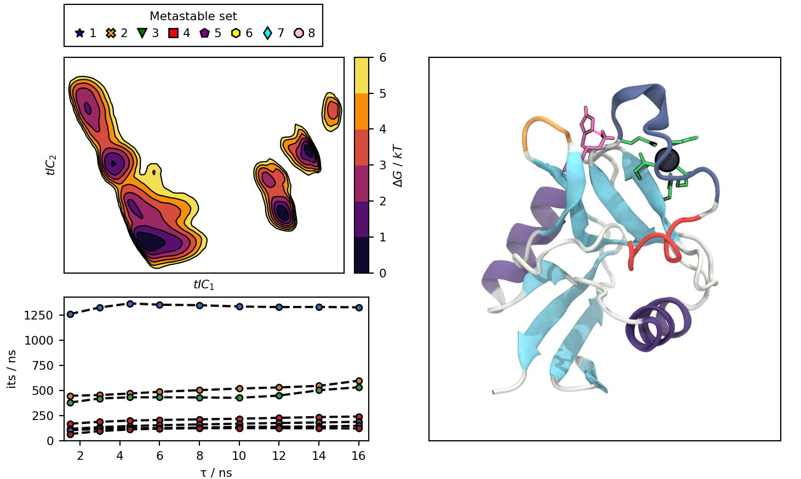
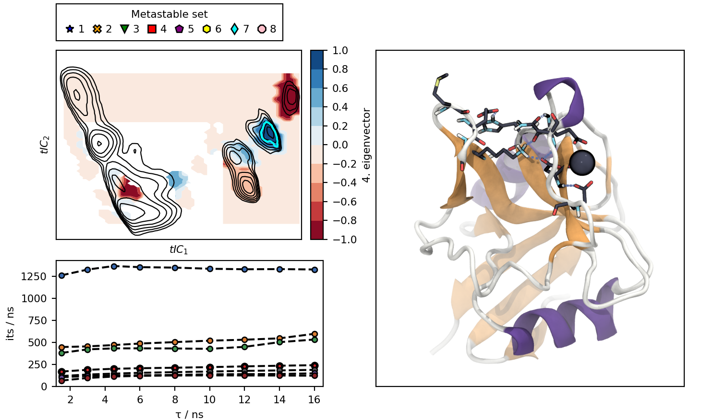

Markov-state model of an endocytic pattern recognition receptor
===============================================================

SciPy John Hunter Excellence in Plotting Competition 2020

Submitted by Jan-Oliver Joswig, PhD student in the Molecular Dynamics Group at Freie Universität Berlin, Germany

Plot
----

The notebook in this repository produces an interactive plot, with this default view:

Clicking on the cluster icons in the legend or on the lines in the lower left plot, changes the illustration:

Files:
------

 - msm.ipynb : Jupyter notebook, containing a description of the background of this contribution, pre-requirements to draw the interactive plot, and the interactive plot itself.
 - data/ :
    - dG.npy, x.npy, y.npy : free energy surface (histogram) and bin mids in two dimensions.
    - dG_<*cluster*>.npy, x_<*cluster*>.npy, y_<*cluster*>.npy : free energy surfaces for clusters of conformations.
    - E_<*process*>.npy, x_e<*cluster*>.npy, y_e<*cluster*>.npy : eigenvector surface for the transition processes.
    - its.npy : implied time scales, corresponding to lag times of the MSMs.
    - lags.npy : lag times for estimated MSMs.
    - conf.png : image of langerin (default).
    - cl<*cluster*>.png : image of a representative structure for the clusters.

 - default_view.png : Picture of the default state of the interactive plot.
 - cluster7_view.png : Picture of the interactive plot were cluster 7 and process 4 were picked.
 - screencast.mp4 : Video demonstrating the interactive plot.
 - matplotlibrc : Matplotlib plot configuration file to ensure a sensible layout in the notebook.
   
